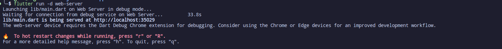

# ChatApp

ChatApp is a cross-platform application created using Flutter and Dart. The application is made with Web3 technologies in mind and the security that the future might provide us in using cryptocurrencies on our everyday life.

## Prerequisities

- [Flutter](https://docs.flutter.dev/get-started/install) 
- [Dart](https://dart.dev/get-dart) 
- [MetaMask extension](https://metamask.io/download/)
- Web3 supported browser like Chrome, Firefox, Brave to name a few examples

## After having all of the prerequisites you can follow the guide ⬇️: 

### Step 1

Run flutter in your Web3 supported browser: 

```bash
flutter run -d web-server
```

You should get something like this: 




### Step 2

Click on the image and connect to your MetaMask account.

### Step 3

Happy chatting in Web3! 🤗


